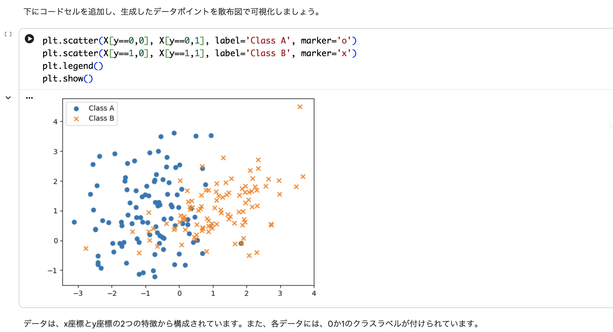
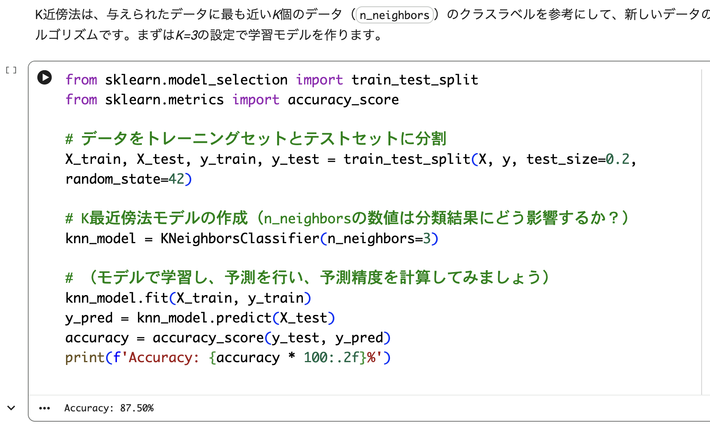
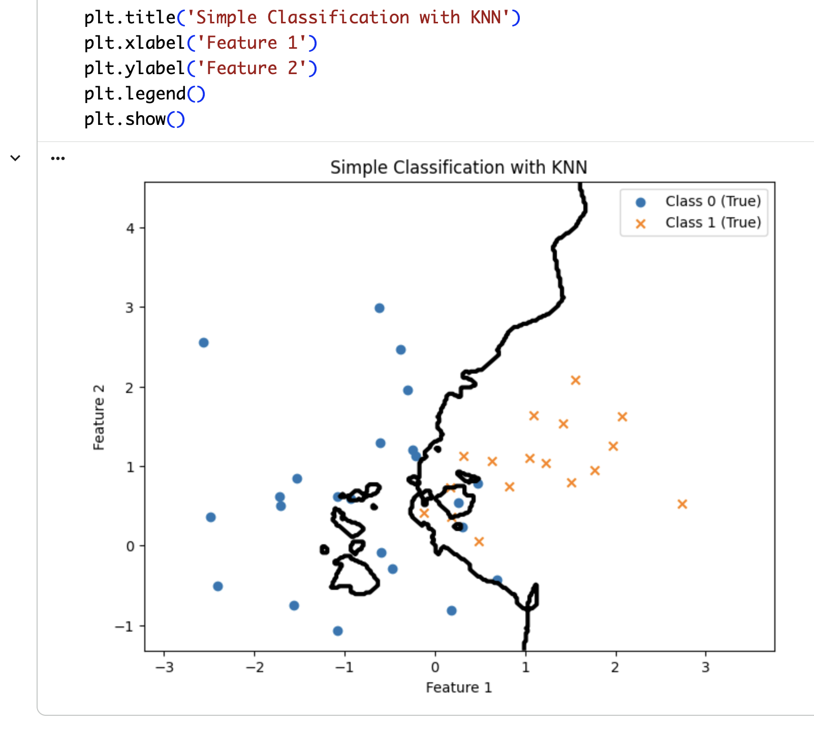
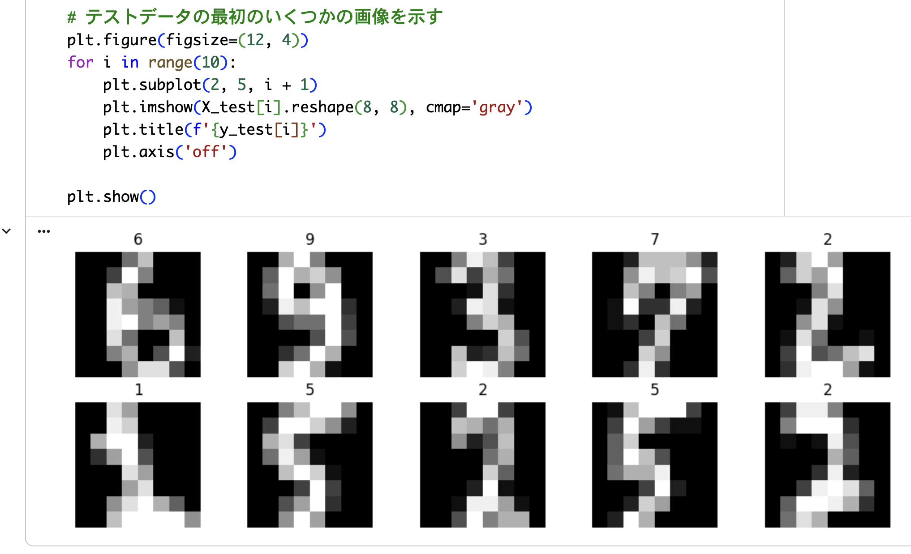
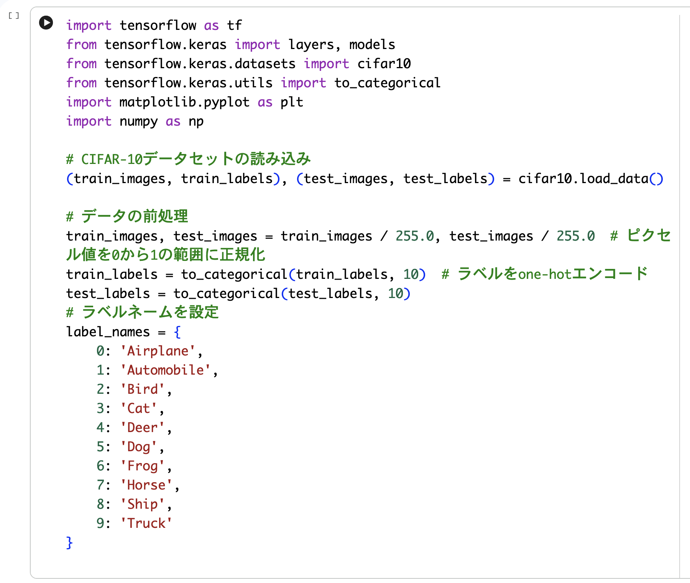
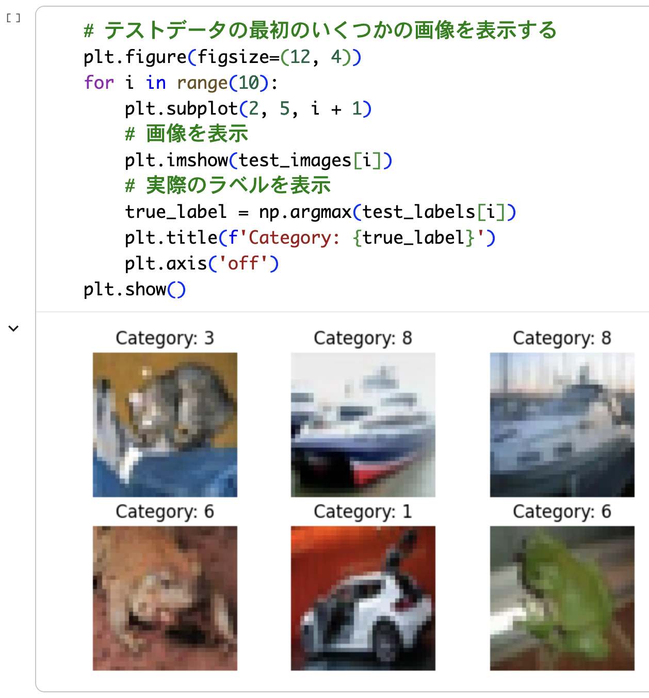
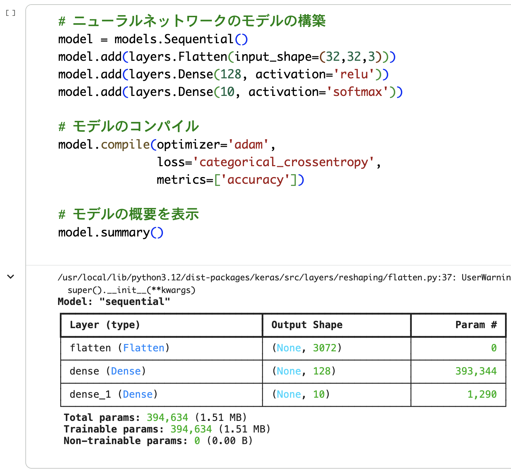
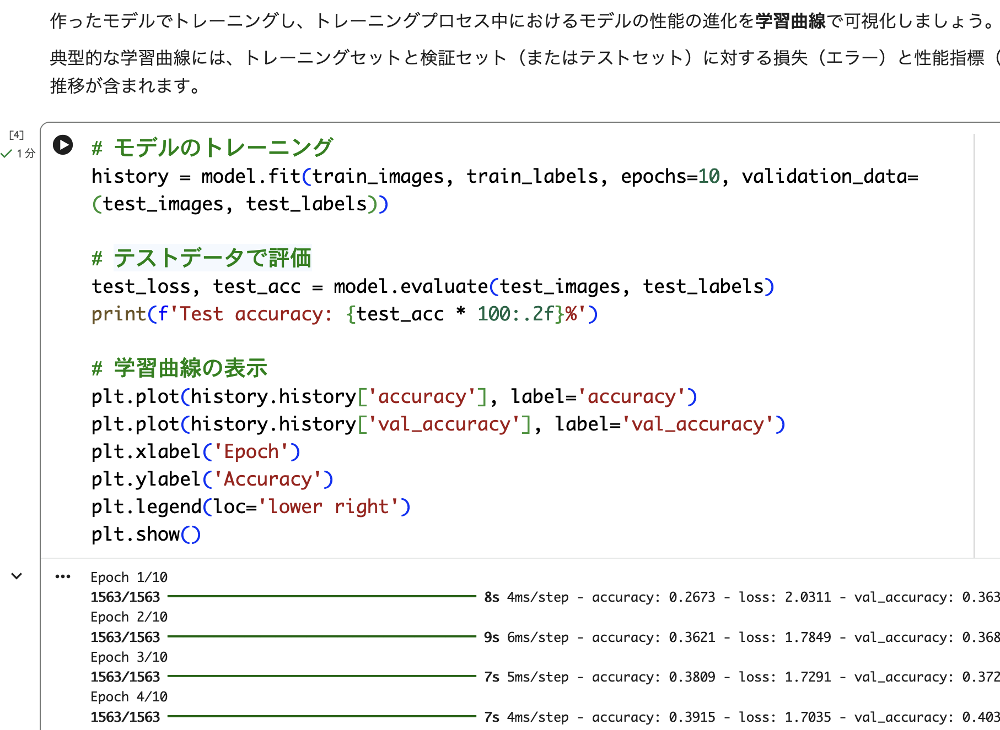
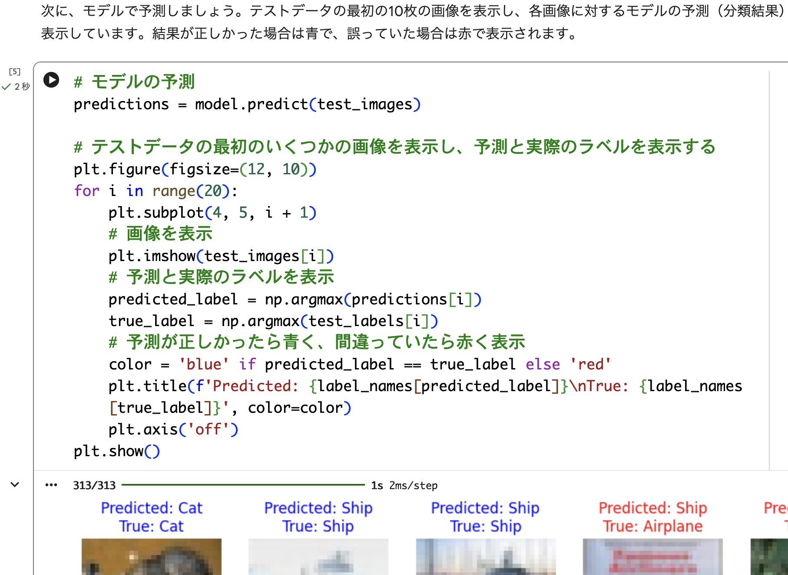

# 機械学習分類演習解答（参考用）

↑のボタンでノートブックを開き、「ファイル」メニューから自分のドライブにコピーしてから、実行してください。

## KNNによるデータ2分類

散布図作成：

モデル学習と評価：

可視化：

## SVMによる手書き数字の認識

## NNによる画像認識

ラベル設定：

画像データを確認：

3層モデルを構築：

モデルの学習：

モデルを用いた予測と結果表示：

