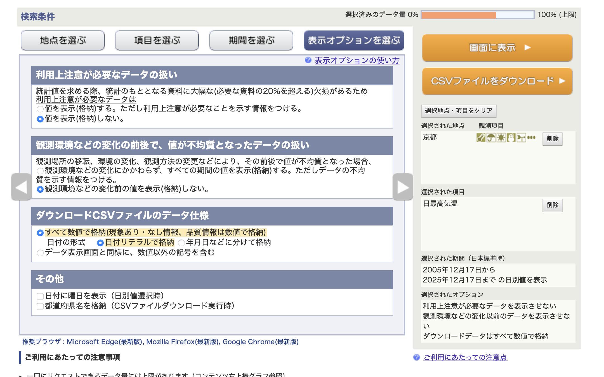
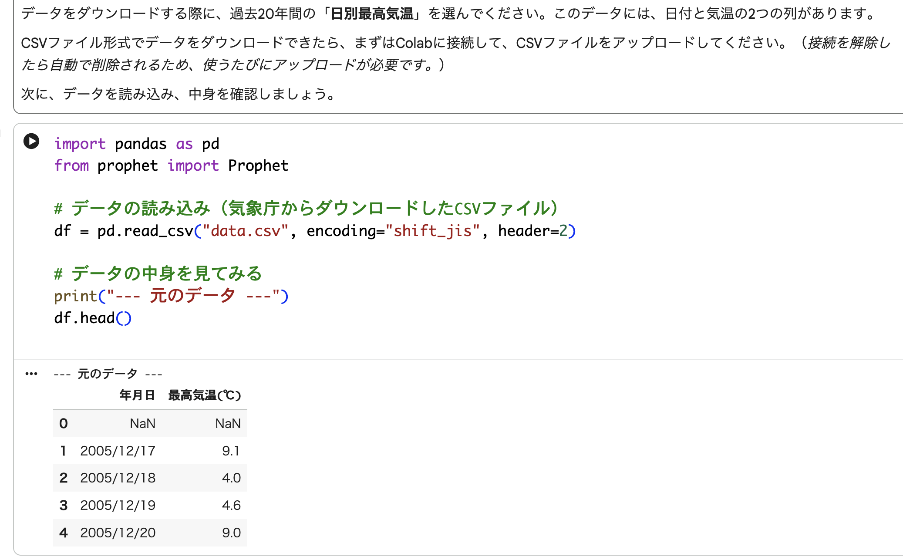
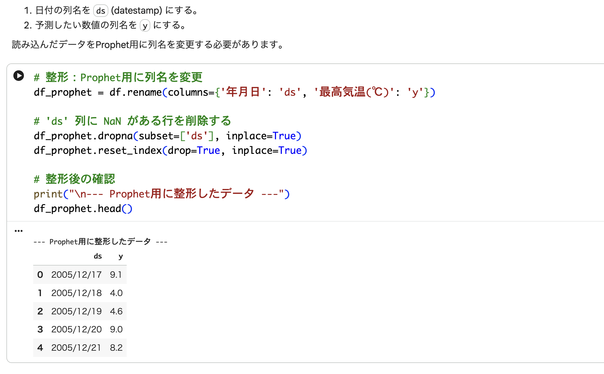
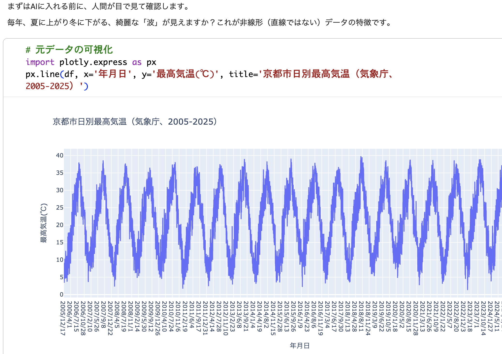
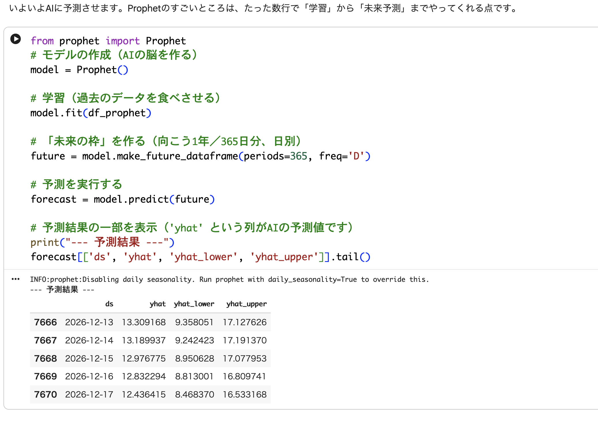
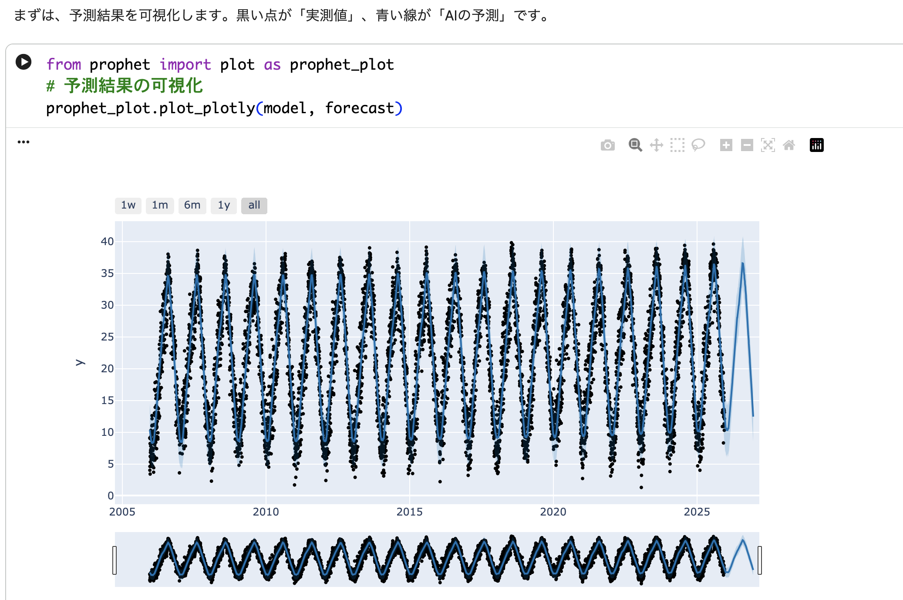
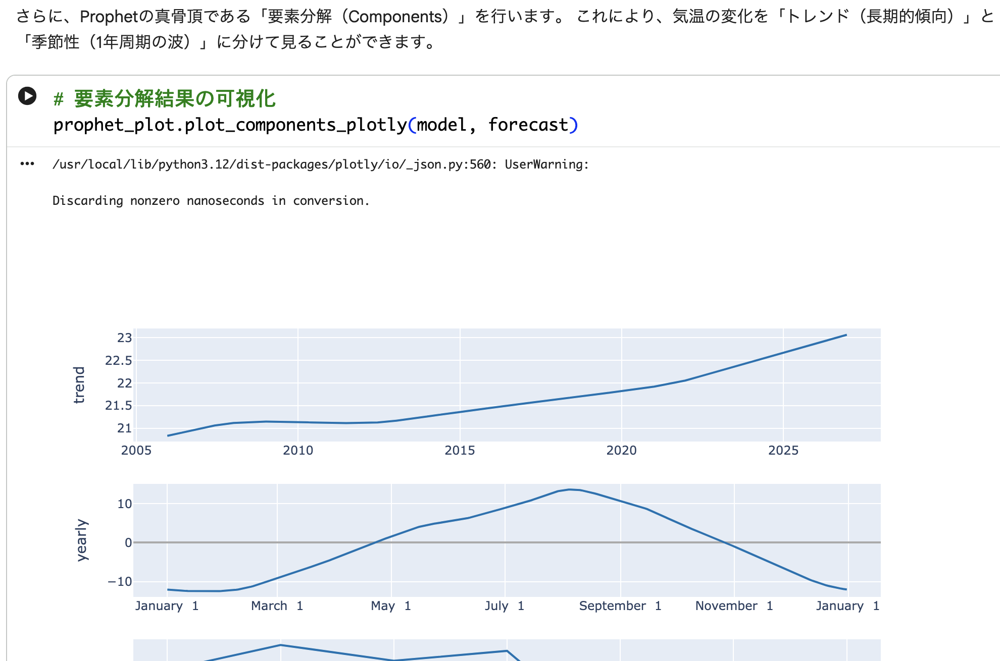

# 機械学習時系列予測演習解答（参考用）

↑のボタンでノートブックを開き、「ファイル」メニューから自分のドライブにコピーしてから、実行してください。

## データのダウンロード

[気象庁](https://www.data.jma.go.jp/risk/obsdl/index.php)から**京都市**の**過去20年間**の**日別最高気温**データをダウンロードする際のオプション設定：

## ステップ１

## ステップ２

## ステップ３

## ステップ４

