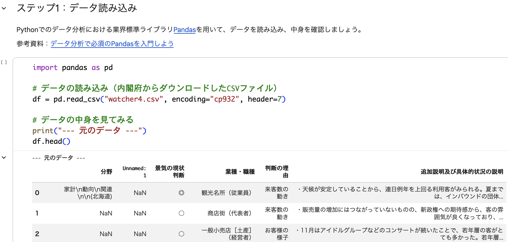
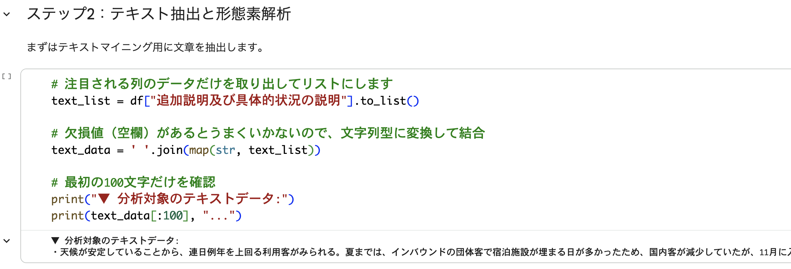
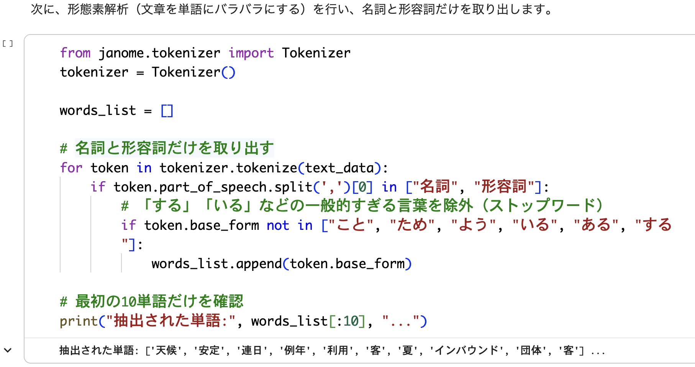
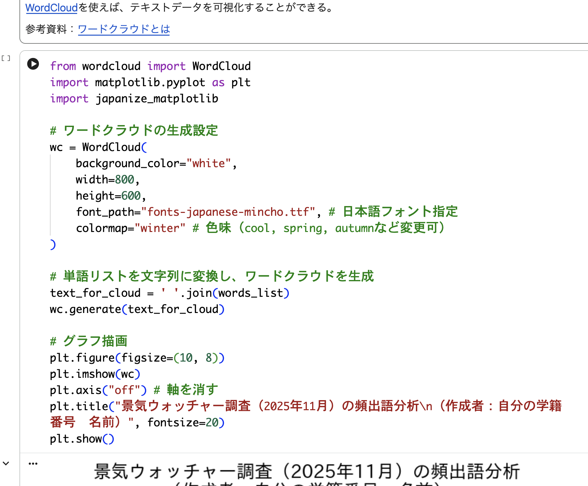
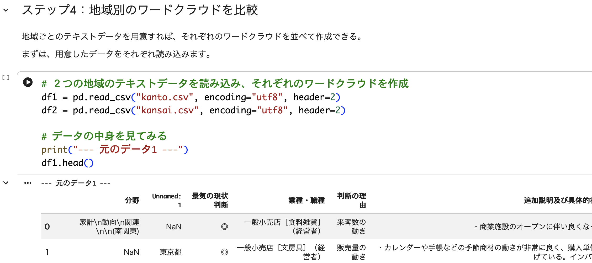
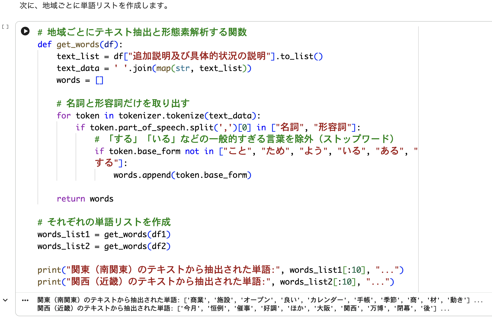
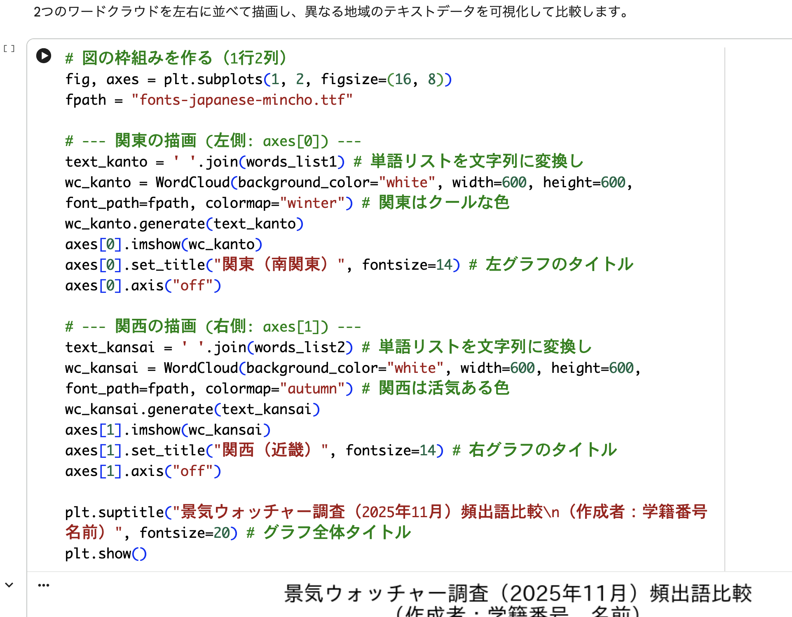

# テキストマイニング練習解答（参考用）

↑のボタンでノートブックを開き、「ファイル」メニューから自分のドライブにコピーしてから、実行してください。

## ステップ１（データ読み込み）

## ステップ2（テキスト抽出と形態素解析）

文章抽出：

単語抽出：

## ステップ3（ワードクラウドの生成）

## ステップ4（地域別のワードクラウドを比較）

データ読み込み：

単語抽出：

ワードクラウド作成：

